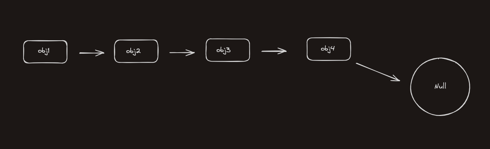

# Linked List

- a linked List is a data structure in which each node points to the another node
- Unlike arrays, whcih have a fixed size, a linked list is a dynamic structure and can re-allocate, de-allocate memory at run time 
- 

# Single linked list

- The single linked list structure is one where each node, has reference to the next node 

 

- a node in a singly linkedList has the following properties: data & next

### Data

- Data is the value for the for the linked list node

### Next

- Next is the pointer for another instance of SinglyLinkedListNode

```javascript
function singlyLinkedListNode(data) {
    this.data = data;
    this.next = null;
}
```

- this is the base code for the singly linked list example
- the code has a helper function to check if the singly linked list is empty 
- the start of the linked list is referred to as the head, the property defaults to null before insertion.

```javascript
function SinglyLinkedListNode() {
    this.head = null;
    this.size = 0;
}

SinglyLinkedList.prototype.isEmpty = function() {
    return this.size = 0
}
```

## Insertion 

- how to insert into a singly linkedList
- if the head of the linked list is empty, the head is set to the new node.

```javascript

SinglyLinkedList.prototype.insert = function(value) {
    if(this.head === null) { //if first node
        this.head = new SinglyLinkedListNode(value); //creates a new node w/ value
    } else {
        // head of list stored in temp, preserves the link to the rest of the list
        var temporaryNode = this.head;  // new node is created with value, new node assigned as new head of the list.
        this.head = new SinglyLinkedListNode(value); // the next pointer of the new head node is set to point to the old head node (now stored in temp). 
        this.head.next = temporaryNode; 
    }
    //increments the size property of the list, keeping track of the total number of nodes.
    this.size++;
}

var sll1 = new SinglyLinkedList();
//linkedList is now: 1 -> null
sll1.insert(1);
//linkedList is now: 12 -> 1 -> null  
sll1.insert(12); 
//linkedList is now: 20 -> 12 -> 1 -> null
sll1.insert(20); 
```

- Time complexity O(1), no loops or traversal is required

## Deletion by value

- the deletion of a node in a singly linked list is implemented by removing the reference of that node.
- if the node is in the middle of the linked list, it is achieved by having the node with the next pointer (node 2) to that node (node 3 - to be deleted),
point to that node's  (node 3 - to be deleted) own next node instead (pointing to 4) - illustrated below.

- **node 2 points to nodes 3's next pointer**


- if the node is at the end of the linked list, then the second to last element can dereference the node, 
by setting it's next to null

```javascript
SinglyLinkedList.prototype.remove = function(value) {
    var currentHead = this.head;
    if (currentHead.data == value) {
        //just shift the head over, this is the new value
        this.head = currentHead.next;
        this.size--;
    } else {
        var prev = currentHead;
        while (currentHead.next) {
            if (currentHead.data == value) {
                //remove by skipping
                prev.next = currentHead.next;
                prev = currentHead;
                currentHead = currentHead.next;
                break;
            }
            prev = currentHead;
            currentHead = currentHead.next;
        }
        //if wasn't found in the middle, or head, must be tail
        if (currentHead.data == value) {
            prev.next = null;
        }
        this.size--;
    }
}

//linkedList is now: 1 -> null
sll1.insert(1);
//linkedList is now: 12 -> 1 -> null  
sll1.insert(12); 
//linkedList is now: 20 -> 12 -> 1 -> null
sll1.insert(20); 
//linkedList is now: 20 -> 1 -> null
sll1.remove(12);
//linkedList is now: 1 -> null
sll1.remove(20);
```
Time complexity: O(n);
in the worst case, the entire linked list must be traversed.
